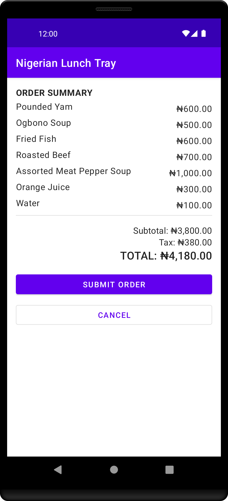

# Nigerian Lunch Tray

## Description

Nigerian Lunch Tray is a modified version of the Lunch Tray app project from Unit 3 (Navigation) of
[Android Basics in Kotlin course](https://developer.android.com/codelabs/basic-android-kotlin-training-project-lunch-tray).

- Adaptation of the Lunch Tray app for ordering Nigerian dishes.
- Android app

## Roadmap

- [x] Basic Lunch Options
- [x] Naira Support
- [ ] Wide-ranging Lunch Options
- [ ] Multi-currency Support

## Screenshots

